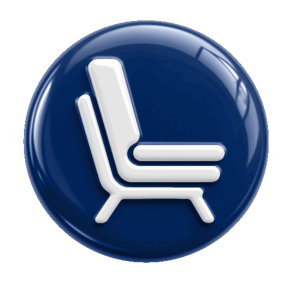
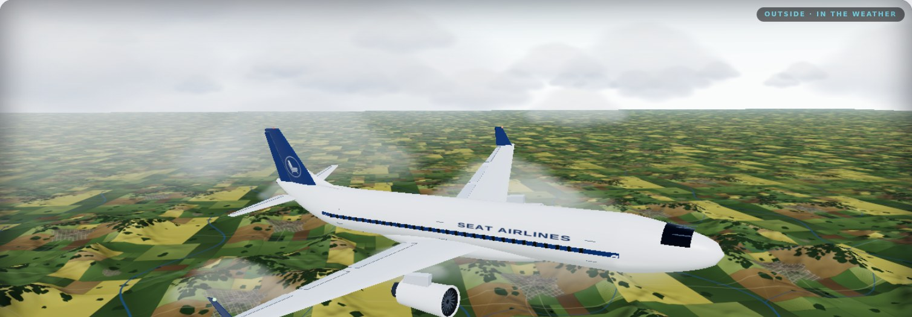
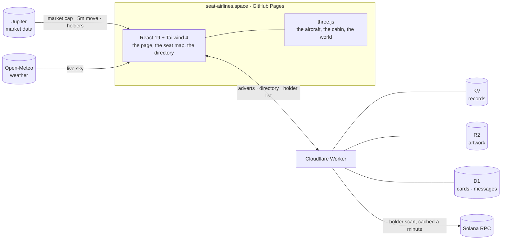

<div align="center">

<a href="https://seat-airlines.space"></a>

# SEAT AIRLINES

**One plane. Everyone's in it. Your bag is your seat.**

A flight simulator flown by one number: the aircraft's altitude and attitude are read live from its token's market,<br>
so the aeroplane on your screen *is* the chart — and its 178 seats go to the biggest holders, in order.

[](https://seat-airlines.space)
[](https://seat-airlines.gitbook.io/seat-airlines-docs/)

[](https://github.com/DOGECOIN87/Seat-Airlines/actions/workflows/deploy.yml)
[](https://github.com/DOGECOIN87/Seat-Airlines/actions/workflows/worker.yml)
[](LICENSE)



<sub>Flight **SA350** · Nonstop · rendered live in the browser — the same scene the cabin windows look out on</sub>

</div>

---

## Contents

- [The premise](#the-premise)
- [How it flies](#how-it-flies)
- [On board](#on-board)
- [Explore the documentation](#explore-the-documentation)
- [For developers](#for-developers) — [architecture](#architecture) · [quick start](#quick-start) · [project structure](#project-structure) · [configuration](#configuration) · [deploying](#deploying)
- [Licence](#licence)

## The premise

| | |
| :-- | :-- |
| **Market cap is altitude** | $163K flies at 163,000 ft. $1M breaks out above the clouds, $10M is space, $50M is the moon. |
| **The five-minute move is attitude** | A rising market pitches the nose up; a falling one pitches it down. |
| **Your bag is your seat** | The 178 biggest holders are seated by rank, flight deck first. Everyone else rides in the cargo hold. |
| **Seats are finite** | Out-hold the holder in front of you and you take their seat — and the PA tells the whole cabin. |
| **Every seat is a billboard** | A seated holder can put a square image on their seat, and it moves with them. |
| **Your seat is how far you can see** | In the cabin directory you read your own section and every cabin behind you — never the ones ahead. |

> [!IMPORTANT]
> Seat Airlines never asks your wallet to approve a transaction. Every signature it requests is a plain-text message, and [Wallet safety](docs/safety/wallet-safety.md) prints each one word for word.

## How it flies

One input drives everything the aircraft does — its token's market data — and nothing else.

| The market's… | …becomes |
| :-- | :-- |
| Market cap | **Altitude**, read straight off the number |
| Five-minute change | **Pitch**; its rate of change becomes **bank** |
| Holder count | **Souls on board** |
| Attitude | The **overhead annunciators**, and the PA announcements they trigger |

Market cap *is* altitude, so the milestones are places:

| Market cap | Where you are |
| :-- | :-- |
| under **$1M** | **In the weather** — rolling farmland, coastlines and open sea below, cloud and haze around you |
| **$1M** | **Above the clouds** — you break out on top of the deck, and the air above thins and deepens |
| **$10M** | **Space** — the sky drains from the zenith down, the ground becomes a curved limb, the stars arrive |
| **$50M** | **The moon** — the lunar surface under a grazing sun, with Earthrise off the port side |

The sky is the visitor's own: the sun is placed from their clock and time zone, and the weather is live from [Open-Meteo](https://open-meteo.com/) — no location prompt, ever. → [The sky outside](docs/how-it-flies/the-sky.md)

## On board

<table>
<tr>
<td width="50%" valign="top">

### A real flight, in 3D

The page opens **outside, on the whole aeroplane**, flying over ground that goes past for real: farmland with rolling hills, woods and rivers, a coast every few minutes and a stretch of open sea. It banks into gentle turns, ailerons and rudder working, and every window lit from outside is a row somebody has genuinely booked.

Step inside to a seat, turn your head, walk the aircraft, climb into the **flight deck** or drop into the **cargo hold**.

→ [Views and controls](docs/the-cabin/views-and-controls.md)

</td>
<td width="50%" valign="top">

### The seat ladder

178 seats across five cabins — **flight deck, first, business, exit row, economy** — filled strictly by rank. Your seat is your placement on the wall, the size of your tile, and how far forward you can see in the directory.

Check in with **Phantom, Solflare or Backpack** and your boarding pass is issued on the spot.

→ [The seat ladder](docs/the-cabin/seat-ladder.md) · [Cabins and seats](docs/the-cabin/cabins-and-seats.md)

</td>
</tr>
<tr>
<td width="50%" valign="top">

### The wall

Every seat is a square, so every held seat is a billboard. Holders put a 1:1 image on the seat they hold; the whole aircraft reads as a mosaic, best placements at the front. Adverts belong to the wallet, so they follow their holder up and down the cabin.

→ [Every seat is a billboard](docs/the-wall/every-seat-is-a-billboard.md)

</td>
<td width="50%" valign="top">

### Section network

A holder directory with the cabin's own manners: publish a card, read your section and every one behind it, introduce yourself, talk in your cabin's room — and from the flight deck, one PA announcement a day that the whole aircraft hears.

→ [Your seat is how far you can see](docs/section-network/how-far-you-can-see.md)

</td>
</tr>
</table>

<div align="center">

<br><sub>The headline is a split-flap departure board, flap by flap — <a href="docs/for-developers/departure-board.md">how it works</a></sub>
</div>

## Explore the documentation

The full guide lives on **[GitBook](https://seat-airlines.gitbook.io/seat-airlines-docs/)**, synced from the [`docs/`](docs) folder of this repository.

<table>
<tr>
<td width="25%" valign="top">

**Getting started**

- [Quick start](docs/getting-started/quick-start.md)
- [The token](docs/getting-started/the-token.md)
- [Connecting a wallet](docs/getting-started/connecting-a-wallet.md)

</td>
<td width="25%" valign="top">

**How it flies**

- [One number flies the plane](docs/how-it-flies/flight-model.md)
- [Altitude bands](docs/how-it-flies/altitude-bands.md)
- [The overhead panel and the PA](docs/how-it-flies/overhead-panel.md)
- [The sky outside](docs/how-it-flies/the-sky.md)

</td>
<td width="25%" valign="top">

**The cabin**

- [The seat ladder](docs/the-cabin/seat-ladder.md)
- [Cabins and seats](docs/the-cabin/cabins-and-seats.md)
- [Views and controls](docs/the-cabin/views-and-controls.md)
- [Your boarding pass](docs/the-cabin/boarding-pass.md)

</td>
<td width="25%" valign="top">

**The wall**

- [Every seat is a billboard](docs/the-wall/every-seat-is-a-billboard.md)
- [Put an advert on your seat](docs/the-wall/put-an-advert-on-your-seat.md)

</td>
</tr>
<tr>
<td valign="top">

**Section network**

- [How far you can see](docs/section-network/how-far-you-can-see.md)
- [Cards and sign-in](docs/section-network/cards-and-sign-in.md)
- [Introductions, rooms and the PA](docs/section-network/introductions-rooms-and-the-pa.md)

</td>
<td valign="top">

**Safety & help**

- [Wallet safety](docs/safety/wallet-safety.md)
- [FAQ](docs/help/faq.md)

</td>
<td colspan="2" valign="top">

**For developers**

- [How it is built](docs/for-developers/how-it-is-built.md) · [Engineering notes](docs/for-developers/engineering-notes.md)
- [Run it locally](docs/for-developers/run-it-locally.md) · [Configuration](docs/for-developers/configuration.md)
- [Worker API](docs/for-developers/worker-api.md) · [Deploying](docs/for-developers/deploying.md)
- [The departure board](docs/for-developers/departure-board.md)

</td>
</tr>
</table>

---

## For developers

<p>


</p>

### Architecture

The page is a static single-page app on GitHub Pages. Anything that has to be shared between visitors — adverts, the directory, the holder list — lives in one Cloudflare Worker, which holds the RPC key so no browser ever has to.



The seat ladder itself lives in [`src/lib/seating.ts`](src/lib/seating.ts) — no browser and no Cloudflare in it — and the page and the Worker import the same file, so they cannot disagree about who sits where. → [How it is built](docs/for-developers/how-it-is-built.md) · [Engineering notes](docs/for-developers/engineering-notes.md)

### Quick start

Requires **Node 22**.

```bash
npm install
npm run dev          # http://localhost:3000
npm test             # the page's unit suites
npm run build        # typecheck, then bundle to dist/
```

With no configuration at all, a build flies the committed token against the production Worker. To run the Worker locally too — Miniflare, with simulated KV, R2 and D1 — see [Run it locally](docs/for-developers/run-it-locally.md) and the [Worker's README](worker/README.md).

### Project structure

```
├── src/
│   ├── App.tsx              the page: hero, the wall, the network, check-in
│   ├── components/          views, the seat map, the directory, the departure board
│   ├── three/               the 3D world: sky, terrain, the aeroplane, the cabin
│   ├── lib/                 flight model, market feed, seating, wallet, directory client
│   └── content/cabin.ts     the cabin's layout and copy
├── worker/                  the Cloudflare Worker: adverts, directory, holders
├── docs/                    the GitBook documentation (synced both ways)
├── test/                    unit suites for the page
├── public/                  icons, logo, audio, CNAME
└── gitbook-docs.yaml        the GitBook site contract
```

### Configuration

Every setting is optional, and every `VITE_` value is **public** — Vite writes it into the bundle — so they are repository *variables*, never secrets.

| Variable | What it does |
| :-- | :-- |
| `VITE_TOKEN_MINT` | The token the aircraft flies; overrides the committed address |
| `VITE_BANNERS_API` | The Worker: the advert wall, and by default everything else |
| `VITE_HOLDERS_URL` | An indexer for the holder list, if you have one |
| `VITE_DOCS_URL` | Where the footer's *Docs on GitBook* link goes |

> [!WARNING]
> Leave `VITE_RPC_URL` unset in production. Its URL — key and all — would ship to every visitor. The Worker holds the RPC endpoint as a secret instead.

The full list, and the Worker's bindings and secrets: [Configuration](docs/for-developers/configuration.md).

### Deploying

| What | How |
| :-- | :-- |
| **The page** | Every push to `main` runs the tests, builds and publishes to GitHub Pages at [seat-airlines.space](https://seat-airlines.space). |
| **The Worker** | Pushes that touch `worker/` type-check, test and deploy it — when the repository has a `CLOUDFLARE_API_TOKEN` secret. |
| **The docs** | GitBook Git Sync publishes `docs/`; a push that changes only the docs does not redeploy the site. |
| **A new token** | `npm run token:update -- <mint>` moves every copy of the address — page, Worker and docs — together. |

Step by step, including DNS for the custom domain: [Deploying](docs/for-developers/deploying.md).

## Licence

[MIT](LICENSE) © 2026 Matt Mobley

<div align="center">
<br>
<sub><b>SEAT AIRLINES</b> · Flight SA350 · Nonstop · <i>Hold more. Fly higher.</i></sub>
</div>
