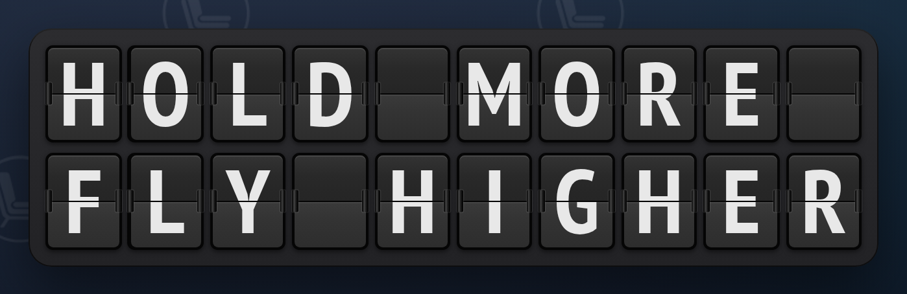

# Welcome aboard

**Seat Airlines** is a flight simulator flown by one number. The aircraft's altitude and attitude are read live from the market for its token, so the aeroplane on your screen _is_ the chart. Inside it are 178 seats, and they go to the biggest holders, in order.

Flight **SA350** · Nonstop · [seat-airlines.space](https://seat-airlines.space)

## The premise

| | |
| --- | --- |
| **Market cap is altitude** | $163K flies at 163,000 ft. $1M breaks out above the clouds, $10M is space, $50M is the moon. |
| **The five-minute move is attitude** | A rising market pitches the nose up; a falling one pitches it down. |
| **Your bag is your seat** | The 178 biggest holders are seated by rank, flight deck first. Everyone else rides in the cargo hold. |
| **Seats are finite** | Out-hold the holder in front of you and you take their seat, and they move back. When your seat changes, the PA announces it. |
| **Every seat is a billboard** | A seated holder can put a square image on their seat, and it moves with them. |
| **Your seat is how far you can see** | In the cabin directory you read your own section and every cabin behind you — never the ones ahead. |

## Where to next

<table data-view="cards"><thead><tr><th></th><th></th><th data-hidden data-card-target data-type="content-ref"></th></tr></thead><tbody><tr><td><strong>Quick start</strong></td><td>From zero to seated in four steps.</td><td><a href="getting-started/quick-start.md">quick-start.md</a></td></tr><tr><td><strong>How it flies</strong></td><td>What each number does to the aircraft.</td><td><a href="how-it-flies/flight-model.md">flight-model.md</a></td></tr><tr><td><strong>The seat ladder</strong></td><td>Who sits where, and how to move up.</td><td><a href="the-cabin/seat-ladder.md">seat-ladder.md</a></td></tr><tr><td><strong>The wall</strong></td><td>Put an image on the seat you hold.</td><td><a href="the-wall/every-seat-is-a-billboard.md">every-seat-is-a-billboard.md</a></td></tr><tr><td><strong>Section network</strong></td><td>Cards, introductions, rooms and the PA.</td><td><a href="section-network/how-far-you-can-see.md">how-far-you-can-see.md</a></td></tr><tr><td><strong>Wallet safety</strong></td><td>Exactly what you are ever asked to sign.</td><td><a href="safety/wallet-safety.md">wallet-safety.md</a></td></tr></tbody></table>


Seat Airlines never asks your wallet to approve a transaction. Every signature it requests is a plain-text message, and [Wallet safety](safety/wallet-safety.md) prints each one word for word.

