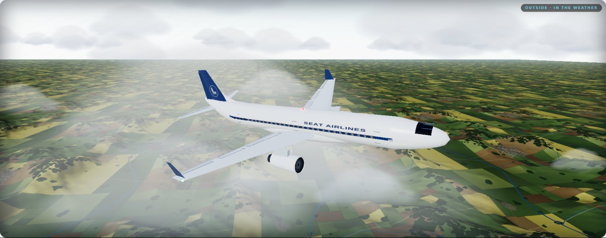
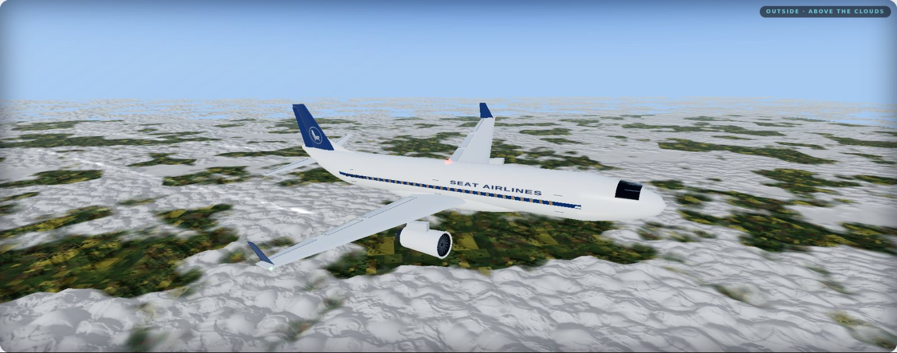
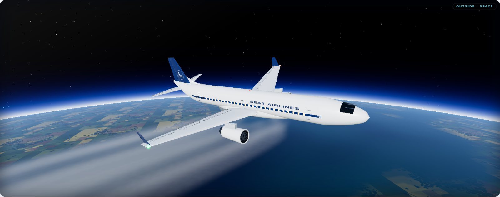
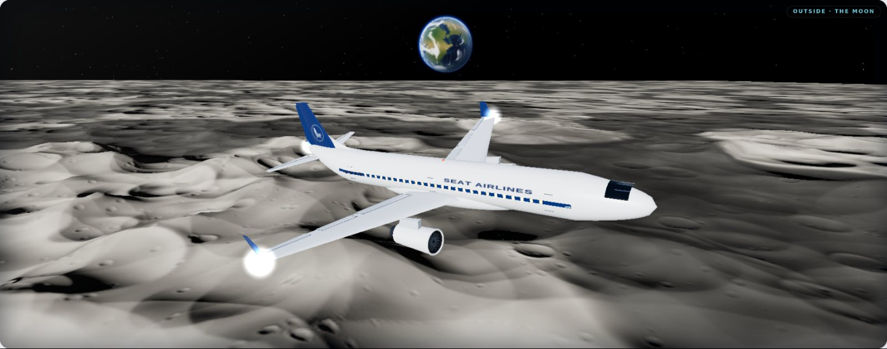
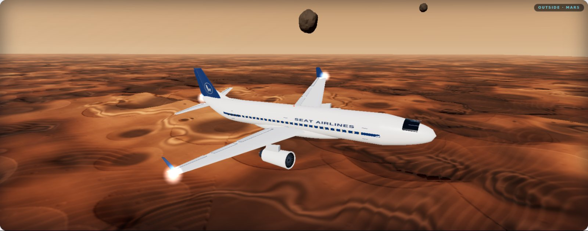

# The five levels

Because market cap _is_ altitude, the milestones are places. There are five of them so far. Crossing into each one changes the whole world outside the windows, and the PA says so.

| Market cap | Level | On the PA |
| --- | --- | --- |
| under $1M | **In the weather** | _"Back in the weather. Seat belt sign is on."_ — when you drop back into it |
| $1M | **Above the clouds** | _"We are on top. Cloud deck below us."_ |
| $10M | **Space** | _"Cabin crew, the sky has run out. Sky is black."_ |
| $50M | **The moon** | _"Ladies and gentlemen, we have reached the moon."_ |
| $100M | **Mars** | _"Ladies and gentlemen, welcome to Mars. Mind the dust."_ |

Within a level the climb is continuous: the higher the market cap, the higher the aircraft, and the view changes with it.

## In the weather — under $1M

Low over the country, among the cumulus. Fields and hedgerows, woods on the high ground, a river and its lakes down in the valleys, and towns that light up as it gets dark. The hills are real relief, not a painted picture. Every few minutes the flight crosses a coast and a stretch of open sea. The sky is your own: the sun where your clock puts it, and your local weather.

## Above the clouds — $1M

You break out on top of the deck. A sea of cumulus runs to the horizon, its billowing tops lit by the sun, with gaps down to the country below that open and close with the real weather. The cloud is nearer than the ground, so it sweeps past faster than the land through the gaps, and that difference is how high you are. The air above thins to a deeper blue.

## Space — $10M

The sky drains to black and the horizon bends into the limb of a planet: oceans, coastlines, weather systems and, where the land shows through, the fields you flew over. The atmosphere is a thin glowing band along the limb, bright on the day side, and the stars are out. The higher the market cap goes, the harder the horizon curves.

## The moon — $50M

Cratered highlands and dark maria under a low sun. Every crater is in relief — raised rims, deep bowls, central peaks in the big ones — and the youngest throw bright rays across the plain. There is no air, so there is no haze and the horizon is knife-sharp. Earth hangs off the port side, blue and white, with its own glowing atmosphere.

## Mars — $100M

The furthest out the aircraft flies — so far. Layered mesas with their strata showing, old craters filled with dark sand, and dune fields in the low ground, fading into a dusty butterscotch sky. The sun is smaller out here and its halo is pale dust. Phobos and Deimos, small, dark and lumpy, hang off the port side.

## Where you are right now

* The label at the top of the page — **Live · SA350 · In the weather**, for example — names the current level.
* The **flight progress** map under the view draws every level on one line, like the moving map on a seatback screen: lit as far as you have come, the aircraft where it is, the next stop ringed, and how far through the climb to it you are. It is measured on a log scale, so going from $1M to $2M moves it as much as going from $5M to $10M. The line does not stop at Mars: it carries on, dashed, to a stop that has no name yet.


The levels are about altitude only. The sky's colour and weather within the lower two come from your own clock and local weather — see [The sky outside](the-sky.md). In space, at the moon and on Mars, the sun is placed where it shows the place off.

